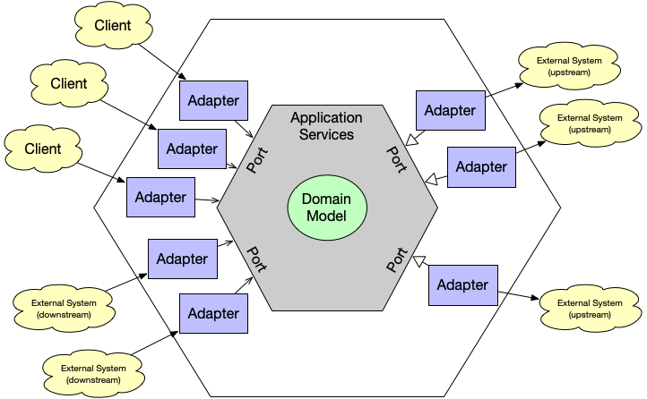
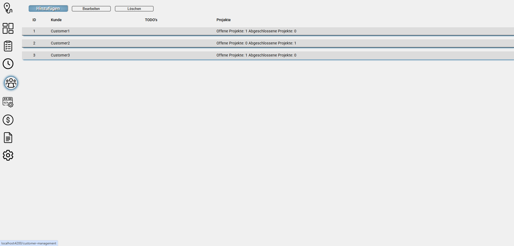
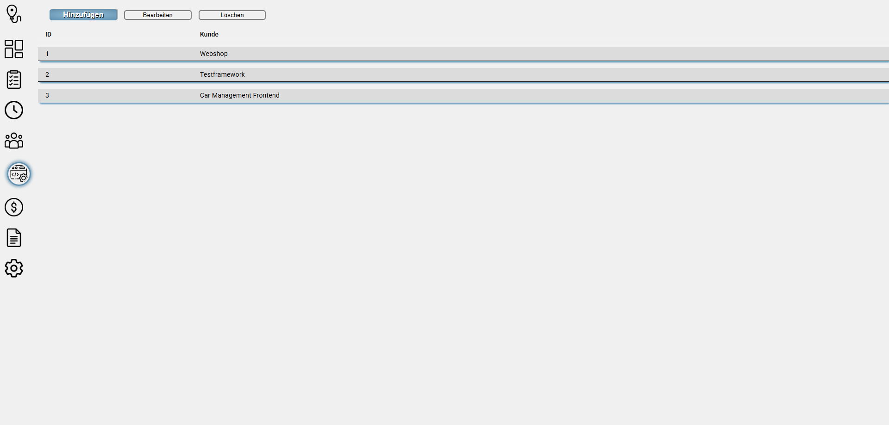
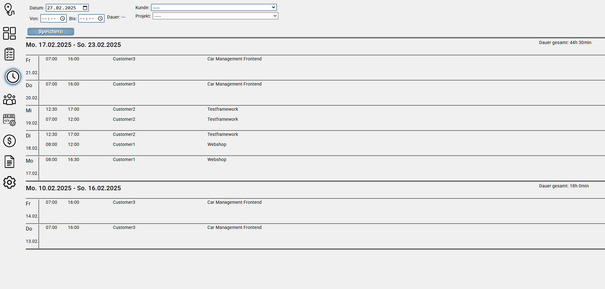
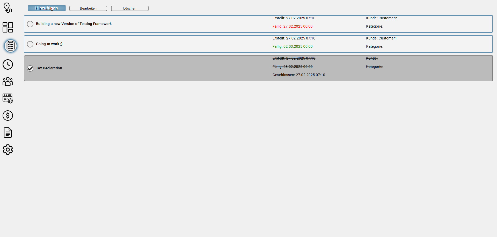
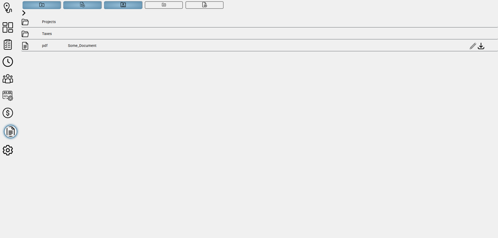
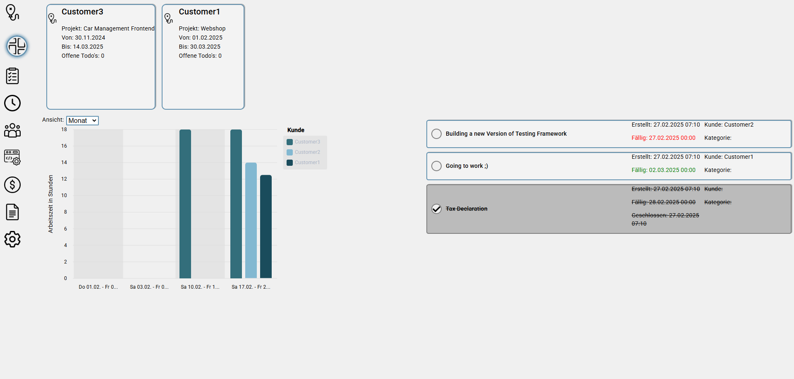

# Monitoring Management System (MMS)

## What is MMS?

MMS is an application for managing tasks, customer, invoices, ... especially for freelancers.

## What can MMS manage

Here is a short overview what MMS can manage. In the chapters below you can see more details of the features.

* [Customer](#customer-management)
* [Projects](#project-management)
* [Working Hours](#working-hours-management)
* [Tasks](#task-management)
* [Documents](#document-management)
* [Dashboard](#dashboard)
* [Invoices (WIP)](#invoice-management)
* [Taxes (WIP)](#tax-management)

## Frontend

The frontend is written with Angular 17.

## Backend

The backend is written in Java and Spring Boot, following the hexagonal architecture pattern.

### Hexagonal Architecture

Hexagonal architecture, also known as the Ports-and-Adapters architecture, is a software design approach that minimizes
dependencies between core logic and external systems. This concept was developed by Alistair Cockburn to make software
flexible, testable, and independent of technical details.

#### Core Principles

Hexagonal architecture is based on a clear separation between core logic and external interfaces. This is achieved
through the use of ports and adapters:

* Core (Domain Logic): Contains the business logic and remains independent of technical details.

* Ports: Define interfaces through which external systems can interact with the core logic.

* Adapters: Implement the ports for specific technologies (e.g., databases, user interfaces, APIs).



#### Advantages

* Technology Independence: The core can operate with different databases, UI frameworks, or external services without
  modification.

* Increased Testability: Business logic can be tested in isolation by replacing real external systems with mocks or
  stubs.

* Flexibility and Extensibility: New interfaces or technologies can be easily integrated by adding new adapters.

#### Structure and Composition

A typical implementation consists of multiple layers:

1. Domain Layer: Contains business rules, entities, and use cases.

2. Application Layer: Controls processes and utilizes domain logic.

3. Adapter Layer: Contains implementations for external systems such as web APIs, databases, or user interfaces.

These layers interact through defined ports, ensuring that changes in one layer do not directly affect the others.

#### Example

Consider an application for order management. The ports define interfaces for order storage and communication with a
payment provider. Adapters could then provide implementations for a relational database and a REST API for payments.

````java

public interface OrderRepository {
    void save(Order order);

    Order findById(String id);
}

public class DatabaseOrderRepository implements OrderRepository {
    @Override
    public void save(Order order) {
        // Save to the database
    }

    @Override
    public Order findById(String id) {
        // Load from the database
    }
}
````

Here, the business logic remains independent of the specific database implementation.

#### Conclusion

Hexagonal architecture promotes a clean separation between core logic and technical details. This makes the software
more flexible, maintainable, and testable. It is especially suitable for applications that need to be maintained
long-term and adapted to different environments.

## MMS Components

This chapter provides you a brief introduction into MMS and shows screenshots of the most relevant parts.

### Customer Management

Customers are the base component of MMS. It provides you an overview of all of your customers, including contact
persons, address, and more. On double-click on a row in the table a Pop-up opens containing all the additional
information of a customer.



### Project Management

Aside to customers, a freelancer has a lot to do with projects. MMS allows you to manage projects, which includes adding
additional project information such as descriptions. You can also link projects to customers, providing a better
overview in the [working hours management](#working-hours-management)



### Working Hours Management

This functionality allows you to manage your working hours per customer and project.



Additionally, it is planned to add an Excel export feature which allows you to export your working hours in any Excel
format for your customer.

### Task Management

The next part of MMS allows you to manage your todos. Each todo can be assigned a due date, a customer and a category.
If the due date is more than one day in the future it is green, if it is tomorrow it gets orange and if it is today or
in the past it becomes red. All not finished todos are sorted by the due date to always see the most relevant on the
top.



### Document Management

MMS can also be used as a document storage to have all documents for your freelancing tasks in one place.



As you can see, you can also create subfolders to structure your data.

")

All documents are stored in the database and on the local disk simultaneously. Here you can see the advantage of the
Hexagonal Architecture. You can implement multiple adapters for persistence. You could switch easily between them or
write an aggregate wich persists the data in both ways at the same time.

### Dashboard

The dashboard provides you an overview over your active projects, your working hours and your todos to have all
important information in one view.



### Invoice Management

This feature has not implemented yet.

It should give the user the ability to create easily invoices. The user can upload templates of the invoice (e.g. in
PDF, AsciiDoc, Markdown, ...). These templates should contain placeholders which are automatically parsed by MMS. If a
new invoice should be created the user fills in the expected vales in a mask in MMS. Then MMS replaces the values for
the placeholders and the user can save the Invoice in PDF format.

### Tax Management

This feature is not implemented yet.

The tax management module calculates the taxes you have to pay, so you have always an overview of your tax burden.
